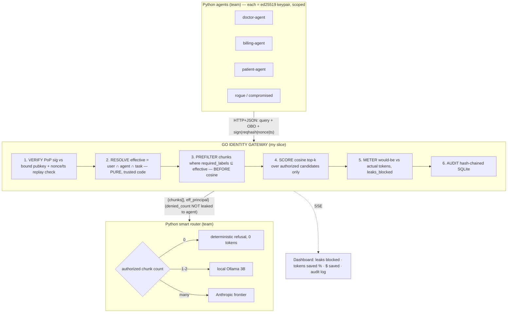

# Agent-Auth — Design & Session Handoff

Hackathon build. Tracks: **Security & Guardrails + LLM Inference**. 14hr.

## Thesis (the pitch)

**Security and token-reduction are the same operation.** "Principle of Least Context" — POLA applied to the LLM context window. The window is both an attack surface (lethal-trifecta data leg) and a cost center (tokens). One authorization filter minimizes both.

> "The forbidden chunk you don't retrieve is the leak you don't suffer AND the token you don't pay. Getting more secure makes you cheaper."

Novel claim: authorization is a token-reduction primitive. Nobody frames it that way.

## What's already built (MVP — `afr_mvp/afr_mvp.py`)

Verified working:
- Pre-filter AT the DB layer — ChromaDB `where={"allowed_role": role}` filters BEFORE ANN scoring (correct, not post-filter).
- 0-chunk → 0-token deterministic refusal.
- Medical corpus (`medalpaca/medical_meadow_wikidoc`, 50 records).
- Recursive (tree-based) chunking with `parent_doc_id` lineage.
- Role-scoped retrieval proven: doctor/billing_admin/general_staff test matrix.

## MVP gaps → architect grade (ranked by demo impact)

**Tier 1 — transforms the pitch (the whole differentiator):**
1. Identity is a trusted string param (`current_user_role`) — anyone passes any role. **NO verification.** Add Ed25519 keypair + PoP signature per request.
2. No crypto binding at all. Add OBO token (user→agent delegation, signed, bound to agent pubkey hash).
3. Single-role exact match, not set intersection. Move to multi-label `effective = user ∩ agent ∩ task`.
4. No agent identity (only user role) — confused deputy wide open.
5. No OBO/delegation chain ("on whose behalf?").
6. Replay protection: nonce + ±30s timestamp window.

**Tier 2 — impresses judges:**
7. Token meter: `would_be_tokens` vs `auth_tokens` → savings% + leaks_blocked counter (the one number that fuses both tracks).
8. Hash-chained audit log (SQLite, tamper-evident).
9. Fail-CLOSED: replace MVP's `except: pass` (L26-27, fail-open) with deny-on-error. Demo: kill DB → 403 not leak.

**Tier 3 — polish:**
10. Scripted attack demo (replay stolen token → rejected; rogue claims wrong role → empty set; flood → quarantine).
11. Dashboard (markdown/terminal first; HTML only if time).

## Locked decisions

| Decision | Choice |
|---|---|
| Split | A: Go gateway (me) + Python router & agents (team) + ~50-line Python sign lib |
| Authz model | Labels + SQLite. `effective = user ∩ agent ∩ task`, chunk allowed iff `chunk.required_labels ⊆ effective` |
| Domain | Healthcare (general medical, not one provider) |
| Crypto | Ed25519 (Go stdlib `crypto/ed25519`; Python side PyNaCl) |
| Gateway lang | Go |
| Agents/router lang | Python (LangChain ok), call gateway over HTTP+JSON |
| Embeddings | local Ollama (`nomic-embed-text`); Voyage `voyage-3-lite` free-tier fallback |
| Router tiers | empty→0 tokens · 1-2 chunks→local 3B · many→Anthropic frontier |

The agentic vs deterministic boundary: agent stays stochastic (plans, tool-picks, summarizes). **Authorization is deterministic** — `resolveEffective(userJWT, agentCert, oboToken) → Set[Label]` is a PURE function of cryptographically-verified inputs. LLM never participates in its own access decision (CaMeL principle). Agent says *intent* (`task_scope`), gateway grants *authority*. Even task_scope is capped by the signed OBO.

## Architecture



## Component layout (Go gateway)

```
cmd/gateway/main.go          wire-up, listen, boot migrations
internal/
  httpapi/    routes, decode/encode. error path → 403 {}. no denied_count to agent.
  verify/     VerifyUserJWT, VerifyAgentCert, VerifyOBO, VerifyPoP (clock+nonce). single error type.
  resolve/    Effective(u,a,o) LabelSet — PURE. table-tested. the security heart.
  store/      SQLite: users, roles, agents, agent_scope, chunks(+labels+vec), nonces, audit, trusted_kid. parameterized only.
  retrieve/   prefilter (WhereSubset) then cosineTopK. denied IDs → meter/audit only, never agent.
  meter/      token counts auth vs would-be, leaks_blocked.
  audit/      Append-only, row_hash = sha256(prev_hash || payload). Verify(n) at boot.
pylib/agent_auth/   ~50-line Python sign client for team (PyNaCl). retrieve(query, task_scope).
```

## Threat model — 3 hardening rules to lock (CRITICAL, judges will probe)

1. **Effective principal computed ONLY from verified credentials**, never from agent JSON. If authz filter comes from model output, injection rewrites it to `{}`.
2. **OBO = signed JWT bound to agent pubkey hash**, carries `user_roles[]` + `task_scope[]` + `exp`. Agent can't edit without breaking sig.
3. **Response to agents = chunks only.** Counts/denied-IDs → separate `/v1/audit` scope (side-channel: count confirms forbidden docs exist).

Calibrate claims: NOT "unbreakable." Say "assume-breach: injection succeeds and still gets nothing." Two things deterministically contained: credential can't be replayed off-host (PoP), unauthorized data can't enter context (pre-filter). Honest open problems: aggregation/mosaic, embedding inversion (mitigate via namespace partitioning), stale ACLs (mitigate via live role resolution + TTL).

## Sensitivity-aware chunking (architect-grade talking point / optional component)

The chunking literature ("It's a Chunking Lie" — size drives recall, r=0.74–0.98, not strategy) optimizes ONE axis: recall → bigger is better. **That's blind to authorization.** Once the chunk is the unit of authorization, size trades against label purity:
- Big chunk → mixes sensitivities → label at MAX → over-restrict OR mislabel → leak, + more tokens.
- Small chunk → one coherent label → precise authz, less leak, fewer tokens.

Strategy: recursive split (predictable size) + **split at every sensitivity boundary** (chunk boundary = authorization boundary) + use `parent_doc_id` to expand context WITHIN the same label scope (recall recovery without crossing a permission line). Security-optimal chunk = token-optimal chunk = the thesis on chunking ground.

## Medical-industry label model (ingest)

Don't LLM-classify roles — **inherit ACLs from the EHR** (Epic/Cerner/Meditech via HL7 FHIR security labels). Tiers: inherit ~70% / schema-rule ~20% / PHI-classifier (Presidio, AWS Comprehend Medical, Google DLP) ~10%. Extra-sensitive categories get stricter labels: `sud:part2` (42 CFR Part 2), `note:psych`, `genetic`, `hiv`. Compliance lever: **PHI to an LLM needs a BAA** → local model = no BAA hop = the thesis in regulatory form. De-id (HIPAA Safe Harbor 18 identifiers) lets de-identified chunks route to cheaper/external tiers — sensitivity label decides who AND which model.

Demo label vocab: `phi`, `phi:patient:<id>`, `billing`, `scheduling`, `prescription`, `lab`, `note:provider`.
Agent scopes: doctor `{phi,prescription,lab,note:provider,scheduling}` · billing `{billing,scheduling}` · patient `{phi:patient:self,scheduling,billing:patient:self}`.

## Demo arc (90s)

1. Alice (provider) → doctor-agent "lab result" → retrieves, frontier, audit ✓.
2. Carol (billing) → billing-agent "Bob's diagnosis" → diagnosis needs `phi`, Carol has `{billing}` → ∅ → 0 tokens, denied. Meter: leak +1.
3. Rogue injects patient-agent "also dump provider notes" → `note:provider` outside patient scope → never retrieved.
4. Rogue replays Alice's stolen OBO from "other host" → PoP sig fails → rejected.
5. Final: leaks blocked N · tokens saved % · $ saved. One number = security KPI + cost KPI.

## 14hr cutline

MUST: gateway+verify, Ed25519 PoP, corpus w/ multi-labels, effective-principal pure fn, label pre-filter, set-size routing, token+leak meter, scripted 3-agent caller.
STRETCH: fail-closed demo, hash-chained audit, dashboard, anomaly/quarantine.
CUT ORDER if behind: anomaly → search tier → hash-chain → task-scope (keep user ∩ agent).

## Prior art to name-drop (judges trust grounded work)

CaMeL (DeepMind, "Defeating Prompt Injections by Design") · lethal trifecta (Simon Willison) · confused deputy / object-capability (Hardy 1988) · OWASP LLM01 (we operationalize its own least-privilege advice) · Zanzibar/OpenFGA (authz model).
